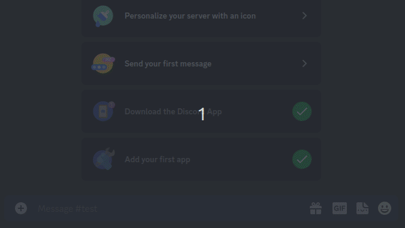

# nlq-discord-bot

Toy Discord bot for NLQ

# How to use

* Create a bot with read message_content permissions and send message.
* Add to server via OAuth2 URL Generator (bot -> Send Message)
* Add keys to `.env` file
* Start bot (`python bot.py`)
* Write messages of the format: `?nlq The query you want here`

# Demo

